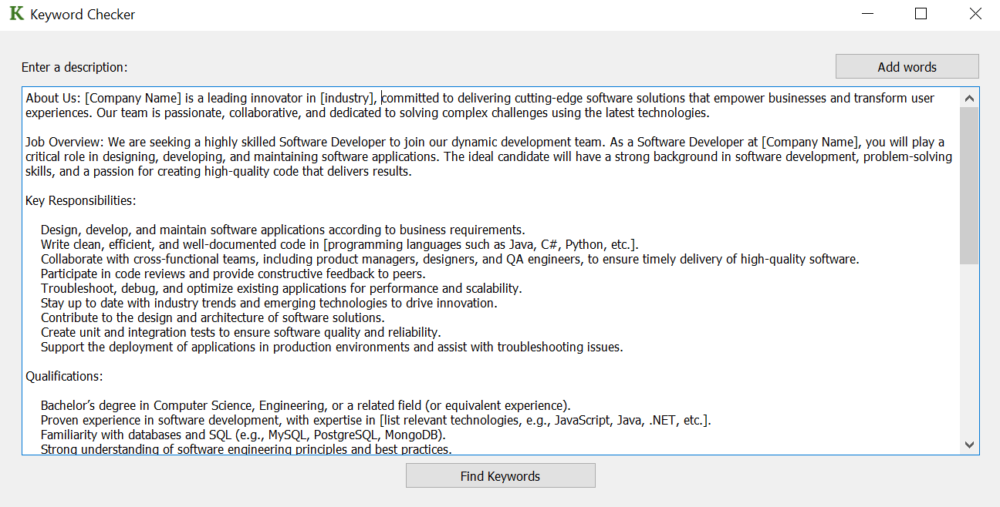
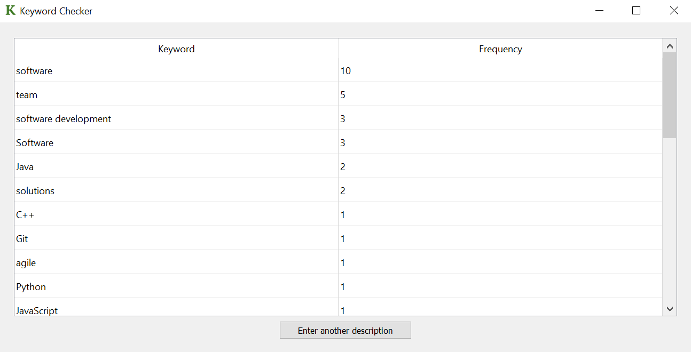
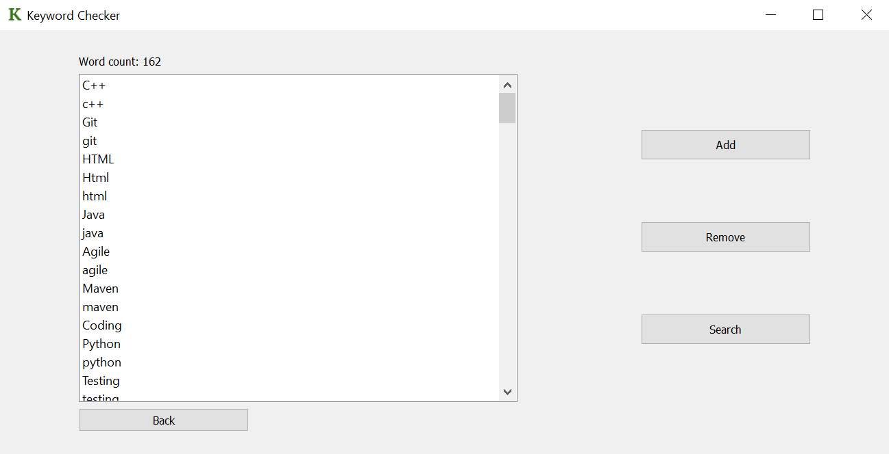

# A simple piece of software that allows users to copy and paste bodies of text and see what keywords are present in the text and how often they appear. It is geared towards software engineering applicatons, but can be re-purposed by changing the keywords list.

[thing.zip](./thing.zip)
